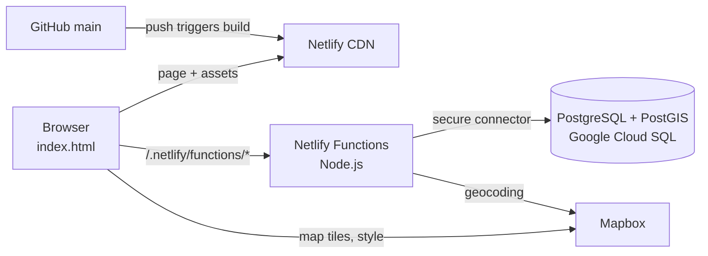

# AssetLogic · LandLogic Asset Monitor

A working proof of concept for an asset-monitoring module inside the LandLogic platform. A user keeps
a watchlist of properties; for each one the system shows its zoning, Official Plan designation,
secondary plan, heritage status, flood risk, nearby development applications and market context, and
raises an alert when any of that changes.

**Live:** https://guileless-monstera-a74dd9.netlify.app

> **Status.** Runs on a real database with real parcel boundaries for Toronto, Mississauga and the
> Region of Waterloo. Planning facts for the first eight properties come from a LandLogic sample
> sheet; market figures and comparables are illustrative placeholders. There is no sign-in yet.

## What it does

| Area | What you can do |
|---|---|
| **Dashboard** | See every watched property in one sortable, filterable table; click a summary tile to filter |
| **Map** | Open a property on a Mapbox map with its true parcel outline, neighbouring parcels and pins for nearby applications |
| **Detail sheet** | Overview, Planning, Development, Risk, Market and Activity tabs for one property |
| **Monitored layers** | Turn data layers on or off per property and set an alert rule on each |
| **Alerts** | One feed of flags across the portfolio; a daily re-check turns changes into new alerts |
| **Add a property** | Type an address: it is geocoded, matched to its parcel, and its facts are derived automatically |

## How it fits together



The page is a single static file. It never talks to the database; it calls small server-side
functions that hold the credentials. Full explanation: [docs/architecture.md](docs/architecture.md).

## Quick start

You need **Node.js 22.15 or newer** and a set of configuration values **issued by the project
administrator** (a Mapbox token and database credentials). Nothing sensitive is in this repository.

```bash
git clone https://github.com/landlogic-corp/AssetLogic_POC.git
cd AssetLogic_POC
npm install
cp .env.example .env.local      # then fill in the values the administrator gives you
npm run build
npm run dev
```

Open http://localhost:8765.

No credentials yet? The page still runs: without database access it shows built-in sample data, and
without a Mapbox token it draws a placeholder map. Step-by-step instructions, including Windows
notes, are in [docs/local-setup.md](docs/local-setup.md).

## Documentation

| Read this | To learn |
|---|---|
| [docs/local-setup.md](docs/local-setup.md) | How to run the project on your machine, step by step |
| [docs/architecture.md](docs/architecture.md) | How the system works end to end, with request-flow diagrams |
| [docs/directory-guide.md](docs/directory-guide.md) | What every file and folder is, and how they connect |
| [docs/frontend.md](docs/frontend.md) | How the page's code is organised and how to change it |
| [docs/api.md](docs/api.md) | Every server function: inputs, outputs, errors |
| [docs/database.md](docs/database.md) | What the database holds and how facts and alerts are produced |
| [docs/data-pipeline.md](docs/data-pipeline.md) | How parcels and other layers are imported |
| [docs/deployment.md](docs/deployment.md) | How changes are reviewed, published and verified |
| [docs/security.md](docs/security.md) | How secrets are handled and what must never be committed |
| [docs/contributing.md](docs/contributing.md) | Working rules, conventions and the review process |
| [docs/troubleshooting.md](docs/troubleshooting.md) | Known problems and their fixes |
| [docs/glossary.md](docs/glossary.md) | Planning and data terms used throughout |
| [docs/release-notes.md](docs/release-notes.md) | What changed, and what comes next |

**Internal documents** (the database ERD, the infrastructure map, the full schema and the
provisioning guide) are not in this repository. LandLogic team members get them from a project
administrator; see [docs/README.md](docs/README.md#internal-documents).

## Repository layout

```
AssetLogic_POC/
├── asset-monitor.html        The page: all HTML, CSS and browser JavaScript (edit this)
├── index.html                Generated from the file above at build time (not in git)
├── netlify/functions/        Server-side API (runs on Netlify, talks to the database)
├── scripts/                  Build, local server, publishing and database tooling
├── docs/                     This documentation
│   └── internal/             Internal documents (not in git)
├── parcels/                  Source parcel files for import (not in git)
├── netlify.toml              Hosting, build, function and header configuration
├── package.json              Dependencies and npm scripts
├── deploy.config.json        Live URL and branch used by the publish script
├── .env.example              Names of the configuration values (no values)
└── CLAUDE.md                 Working rules for AI-assisted sessions on this repo
```

## Security in one paragraph

This repository is public. It contains no tokens, keys or passwords, and its history has been
scanned to confirm that. Configuration lives in a local `.env.local` file and in Netlify's
environment variables. If you are about to commit something and are unsure, read
[docs/security.md](docs/security.md) first.

## Ownership

Built by LandLogic. Questions and access requests: the project administrator at LandLogic.
