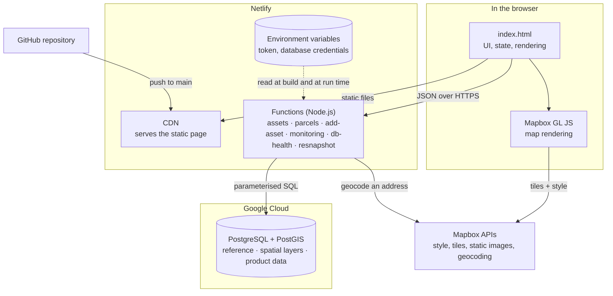
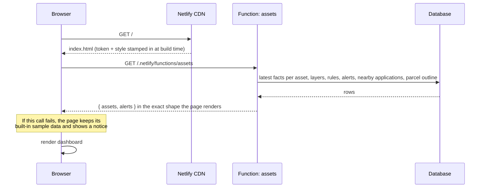
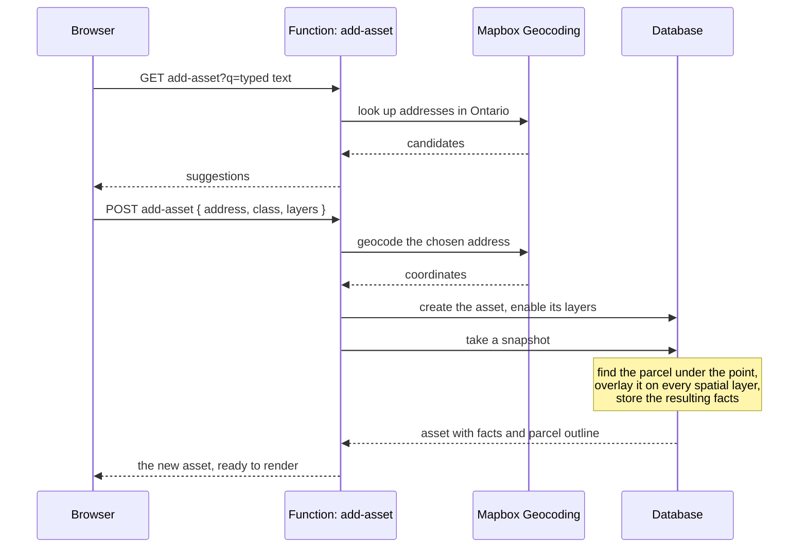
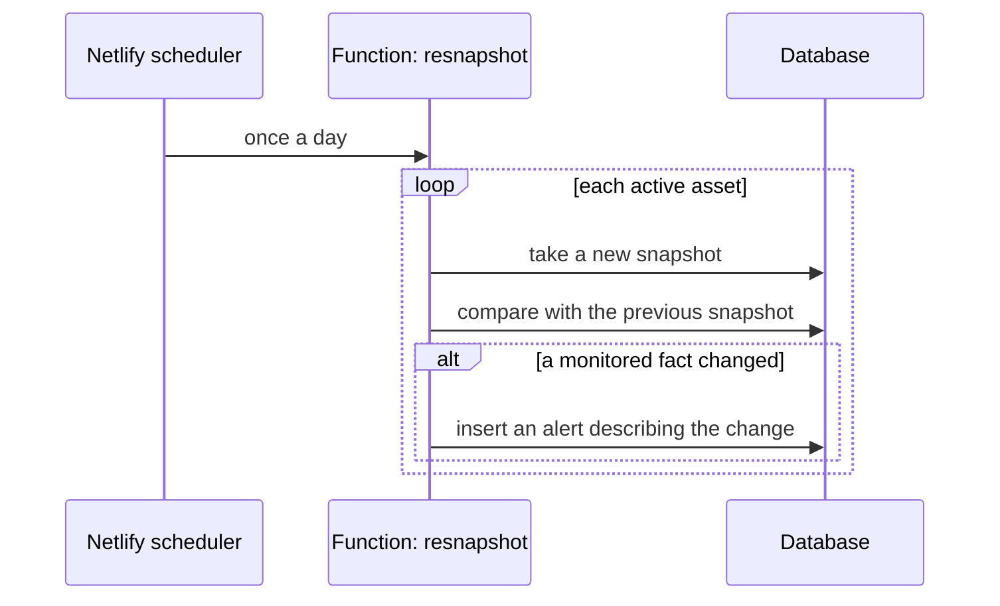
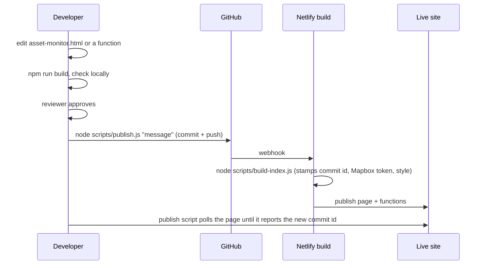

# Architecture

How the system works end to end: the parts, why each exists, and what happens on each kind of request.

## The parts



| Part | What it is | Why it exists |
|---|---|---|
| **The page** | One static HTML file containing all markup, styles and browser code | No framework and no bundler: easy to read, review and host anywhere |
| **Mapbox GL JS** | The map library LandLogic already uses | The map looks and behaves like the rest of the platform |
| **Netlify CDN** | Serves the built page | Deploys on every push, no server to run |
| **Functions** | Six small Node.js handlers | Hold the database credentials so the browser never does; validate input; shape data for the page |
| **Database** | PostgreSQL with the PostGIS spatial extension | Stores hundreds of thousands of parcel polygons and answers "what is under this point" and "what is within 500 m" directly |
| **Mapbox APIs** | Style, tiles, thumbnails, address lookup | Basemap and turning an address into coordinates |

## Two rules the design follows

1. **The browser never touches the database.** Every read and write goes through a function. The page
   ships no database address, user or password.
2. **The page works without its back end.** If the functions are unreachable, it shows built-in
   sample data and says so. If there is no Mapbox token, it draws a placeholder map. This keeps the
   project runnable for anyone who clones it.

## Request flows

### 1. Loading the page



### 2. Opening a property on the map

```mermaid
sequenceDiagram
    participant U as Browser
    participant M as Mapbox
    participant F as Function: parcels
    participant D as Database
    U->>U: switch to map view, centre on the property
    U->>M: style + vector tiles
    M-->>U: basemap
    U->>U: draw the property's parcel outline (already in the asset data)
    U->>F: GET parcels?bbox=… (only at street-level zoom)
    F->>D: parcels intersecting the box (box size is capped)
    D-->>F: up to 4,000 parcels as GeoJSON
    F-->>U: FeatureCollection (cached at the CDN)
    U->>U: draw neighbouring parcels; refetch when the map stops moving
```

### 3. Adding a property



### 4. Changing a setting

Turning a layer on or off, saving or removing an alert rule, marking alerts read and removing a
property all follow the same pattern: the page updates itself immediately, then sends one `POST` (or
`DELETE`) to a function. If the save fails, a notice appears.

### 5. The daily re-check



This is what makes it a *monitor*: facts are captured as snapshots over time, and a difference
between two snapshots is an alert.

### 6. Build and deploy



## How facts are produced

An asset's facts (zoning, designation, heritage, flood risk, nearby counts) are not typed in per
property. They are **derived**:

1. The address becomes a point (geocoding).
2. The point selects a parcel polygon.
3. The parcel is overlaid on each spatial layer: whichever zoning polygon it sits in gives the
   zoning, whichever hazard areas it touches give the flood risk, and so on.
4. The result is stored as a snapshot with a timestamp and a record of how each value was obtained.

Where a layer has not been loaded yet, the snapshot keeps the previous value rather than showing a
blank, and records that it did so. As each layer is loaded, more of the snapshot becomes derived
rather than carried. See [database.md](database.md).

## Where data comes from

Every record that originates outside the system is tagged with its source, its id in that source,
and when it was ingested. A file imported today and an API feed added later write into the same
tables under different source tags, so adding a feed never requires restructuring. See
[data-pipeline.md](data-pipeline.md).

## Design decisions

| Decision | Reason |
|---|---|
| Single-file page, no framework | Small surface, no build toolchain to maintain, trivially hostable |
| `index.html` is generated, not committed | The build stamps the map token into it; keeping it out of git keeps the token out of the public repository |
| Functions return the page's exact data shape | The page needed almost no change to move from sample data to live data |
| PostgreSQL with PostGIS | Spatial questions are one SQL expression instead of application code |
| Parcels fetched by map view, never whole | A city is hundreds of megabytes; a street view is a few hundred kilobytes |
| Snapshots instead of a single "current facts" row | Change detection and history come for free |
| Sample-data fallback | Anyone can run and review the UI without credentials |

## Known limits

- **No sign-in.** Anyone with the URL can read and change the watchlist. Access control is the next
  piece of work.
- **One user.** The API acts as a single administrator account.
- **Most spatial layers are empty.** Parcels are loaded; zoning, plan, heritage and hazard layers are
  waiting on their sources, so those facts are currently carried from the sample sheet.
- **Market data is illustrative.** Clearly labelled in the UI and in the database.

For accounts, instances and credentials, see the internal infrastructure map
([how to get it](README.md#internal-documents)).
