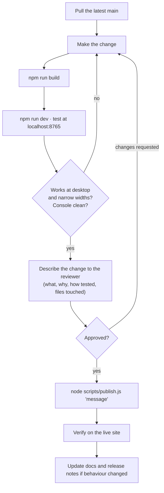

# Contributing

How work is done on this repository.

## The working agreement

1. **`asset-monitor.html` is the source of truth for the UI.** `index.html` is generated; never edit it.
2. **Nothing is pushed without review.** Make the change, build, test locally, describe it to the
   reviewer, and publish only after they approve.
3. **Nothing sensitive is committed.** See [security.md](security.md).
4. **Published means verified.** A change is done when the live site is confirmed to be serving it
   and working, not when the push succeeds.

## A change, start to finish

### What to tell the reviewer

- What changed and why, in plain language.
- Which files were touched.
- How you tested it, and what you did not test.
- Anything that affects data, configuration or security.

## Testing before review

There is no automated test suite yet. Check by hand:

| Check | How |
|---|---|
| Builds | `npm run build` succeeds |
| No script errors | Browser developer console is clean on load and after using the feature |
| Both views | Dashboard and map |
| Both data modes | With the database connected, and with it unreachable (sample data) |
| Both map modes | With a Mapbox token, and without one |
| No overflow | Narrow the window; no text spills out of its box |
| Writes persist | Reload the page and confirm the change is still there |
| API contract | Call the function directly and read the JSON |

## Conventions

### Code

- Plain JavaScript, no framework, no build step beyond `build-index.js`.
- Two-space indentation.
- Escape every value interpolated into HTML with `esc()`.
- Guard writes with `if (API.live)` so the sample-data mode keeps working.
- Functions: validate every input, check ownership, use parameterised queries, return through the
  shared helpers.
- Comments explain why, not what.

### Interface

- Match the LandLogic platform: sidebar, light basemap, white right panel, dark green headings.
- Addresses are always written "street, municipality, province".
- **Text never overflows its container.** Let values wrap. Avoid `white-space: nowrap` on data.
- If a fact is not available, say so. Never invent a value to fill a gap.
- Illustrative data is labelled as illustrative.

### Commits

- One line summary in the imperative: "Add …", "Fix …", "Record …".
- A short body when the reason is not obvious from the summary.
- Commits written with AI assistance end with the co-author trailer.

### Documentation

Documentation is part of the change.

| If you change… | Update… |
|---|---|
| A function's inputs or outputs | [api.md](api.md) |
| The page's structure or the asset shape | [frontend.md](frontend.md) |
| Add, move or remove a file | [directory-guide.md](directory-guide.md) |
| How the project is run or configured | [local-setup.md](local-setup.md), `.env.example` |
| Hosting, build or schedules | [deployment.md](deployment.md) |
| What is stored or how facts are derived | [database.md](database.md) and the internal ERD |
| Anything a user would notice | [release-notes.md](release-notes.md) |

Public documentation explains how the system works. Table definitions, instance names, account
identifiers and provisioning steps belong in the internal documents, not here.

## Branching

Work happens on `main` with review before the push, because every push to `main` deploys. If several
people start working in parallel, move to short-lived branches and pull requests, and let Netlify's
deploy previews become the review surface.

## Working with AI assistants

`CLAUDE.md` at the repository root is read by AI-assisted sessions. It carries the same rules as this
page. If you change a working rule here, change it there too.

## Getting access

Configuration values and internal documents come from the project administrator. See
[local-setup.md](local-setup.md) and [README.md](README.md#internal-documents).
