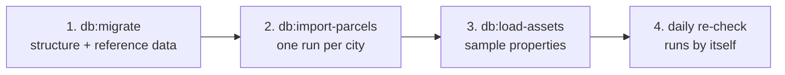
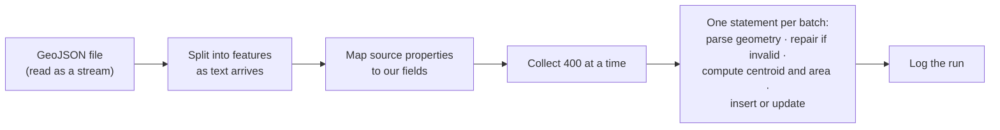

# Data pipeline

How data gets into the database: what has been loaded, how the importers work, and how to add a new
dataset.

These tasks are for administrators. They need database credentials and, for some steps, internal
files that are not in this repository ([how to get them](README.md#internal-documents)). A developer
running the project locally does not need to run any of them.

## The order things are loaded

| Step | Command | What it does | Safe to repeat |
|---|---|---|---|
| 1 | `npm run db:migrate` | Creates the database structure if it is absent, then seeds municipalities, the data-source register, the layer list and the administrator user | Yes |
| 2 | `npm run db:import-parcels -- toronto` (also `mississauga`, `waterloo`) | Streams a city's parcel file into the parcel fabric | Yes |
| 3 | `npm run db:load-assets` | Loads the sample properties with their facts, layers, rules and alerts, and links each to its parcel | Yes |
| 4 | automatic | The scheduled function re-checks every asset daily | n/a |

Step 1 needs the internal schema definition at `docs/internal/schema.sql`. Step 2 needs the source
files in `parcels/`. Neither is in git.

## What has been loaded

| Dataset | Records | Notes |
|---|---|---|
| Parcels, Toronto | 498,589 | Geometry and a parcel type. No addresses or parcel identifiers in the source |
| Parcels, Mississauga | 166,923 | Geometry, a city parcel id and area. No addresses in the source |
| Parcels, Region of Waterloo | 167,275 | Geometry, roll number, address, municipality, tax class, legal description. Covers Kitchener, Cambridge, Waterloo and four townships |
| Sample properties | 8 | From a LandLogic sample sheet |

All three parcel files arrived in longitude/latitude, so no reprojection was needed. The column-by-
column mapping of each file is in the internal source-data mapping document.

**Consequence worth knowing:** because only the Waterloo Region file includes addresses, parcels in
Toronto and Mississauga can be found by map position or by geocoding an address, but not by
searching an address or parcel identifier directly. Closing that gap needs an address-point dataset
for those cities, or the LandLogic database.

## How the parcel importer works

`scripts/import-parcels.js` handles files of hundreds of megabytes on an ordinary laptop.

Why it is fast and safe:

- **Streaming.** The file is never loaded whole. Memory use stays flat regardless of file size.
- **Batching.** Four hundred parcels go to the database in one statement, so there is one network
  round trip per batch, not per parcel.
- **The database does the geometry work.** Parsing, validity repair, centroid and area are computed
  in that same statement by PostGIS.
- **Insert or update.** Each parcel is keyed on its source and its id in that source. Running the
  import again refreshes records; it never duplicates them.
- **Logged.** Every run records what it read, what it wrote, how long it took and whether it
  succeeded.

Measured throughput was about 4,000 parcels per second; all three cities took roughly four minutes.

Where a source provides an area, it is copied. Where it does not, the area is computed from the
geometry. Land-use values are copied from whatever classification the source publishes; nothing is
inferred.

## How the sample properties are loaded

`scripts/load-assets.js` reads the sample data block inside `asset-monitor.html` (the same data the
page uses as its offline fallback) and writes it to the database, so there is a single definition of
the sample set. It then links each property to the parcel under its coordinates.

## Adding a new dataset

The structure for zoning, Official Plan designations, secondary plans, heritage, hazards,
applications, permits and sales already exists. Loading one is a matter of writing an importer.

1. **Inspect the source first.** Record count, coordinate system, geometry types, property names,
   how complete each property is, whether ids are unique. Do this with a streaming script; do not
   open a large file in an editor.
2. **Register the source.** Add an entry to the data-source list in `scripts/db-migrate.js` with a
   short code, a name, its kind (`file`, `api`, `mcp` or `manual`) and the provider, then run
   `npm run db:migrate`.
3. **Write the importer.** Copy `scripts/import-parcels.js`. Change three things: the file and source
   code, the function that maps source properties to fields, and the insert statement's target and
   columns. Keep the batching, the insert-or-update key and the run log.
4. **Reproject if needed.** If the source is not in longitude/latitude, convert inside the insert
   statement with PostGIS rather than in JavaScript.
5. **Run it on a small slice first**, inside a transaction that you roll back, and compare a few
   computed values with the source.
6. **Run it fully**, then re-check the assets (`POST /resnapshot`, or wait for the daily run). Facts
   that were carried from the sample sheet become derived from the new layer.
7. **Document it** in the internal source-data mapping.

For a feed that arrives through an API or MCP rather than a file, steps 2 and 6 are the same; step 3
becomes a function or script that pages through the feed and writes the same way.

## Illustrative data

Market series and comparable sales are placeholders chosen to be plausible per municipality. They are
tagged with their own source so they can be identified and replaced in one step, and the interface
labels them as illustrative. Do not present them as market evidence.

## Where source files live

`parcels/` in the project folder, which git ignores by name, as it does any `.geojson`, shapefile,
GeoPackage or zip anywhere in the repository. Source files are never committed.
