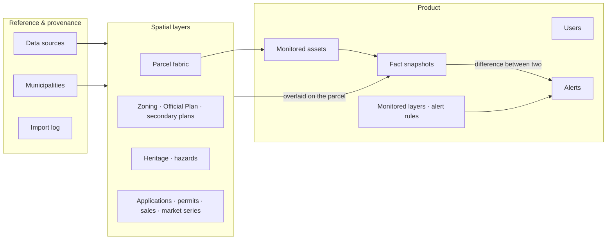
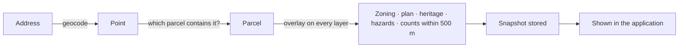

# Database overview

What the database holds and how it turns raw layers into facts and alerts. This page is conceptual.
The table-by-table definition, the entity-relationship diagram and the full schema are internal
documents ([how to get them](README.md#internal-documents)).

## Technology

PostgreSQL with the **PostGIS** extension, hosted as a managed service. PostGIS adds geometry types
and spatial functions, so questions such as "which parcel contains this point", "which zone does this
parcel sit in" and "what lies within 500 metres" are single queries backed by spatial indexes.

All coordinates are stored as longitude and latitude (WGS84). Distances are computed in metres.

## Three areas

| Area | Holds | Changes when |
|---|---|---|
| **Reference and provenance** | The municipalities covered; a register of every data feed; a log of every import | A feed is added or an import runs |
| **Spatial layers** | The parcel fabric for whole cities, and the layers a property is checked against: zoning, plan designations, secondary plan boundaries, heritage, hazards, development applications, permits, sales, market series | Data is imported or synced |
| **Product** | Users, the properties they monitor, snapshots of each property's facts over time, which layers are monitored, alert rules and alerts | People use the application, and the daily re-check runs |

## Key ideas

### Parcels are the anchor
A monitored asset is linked to the parcel it sits on. Everything else is derived from that parcel's
position relative to the other layers.

### Facts are snapshots
An asset does not have one row of "current facts". Each check writes a new snapshot with a timestamp
and a record of how each value was obtained (derived spatially, supplied by an API, or entered from a
source document). The application shows the latest one.

### Alerts are differences
The daily re-check takes a new snapshot and compares it with the previous one. A monitored fact that
changed becomes an alert. History is therefore kept automatically, and "what changed and when" is
always answerable.

### Every outside record knows where it came from
Each imported record carries its source, its identifier in that source, and when it was ingested,
plus a free-form store for source columns that are not modelled yet. Consequences:

- Imports are repeatable: running one again updates records instead of duplicating them.
- A file import and an API feed fill the same tables under different source tags. Connecting the
  LandLogic database later is a new source, not a redesign.
- Nothing from a source is discarded.

### Missing layers do not produce blanks
If a layer has not been loaded for an area, the snapshot keeps the previous value for that fact and
records that it was carried forward. As layers are loaded, facts move from carried to derived without
any change to the application.

## How a property is added

If the point lands on a road rather than inside a parcel, the nearest parcel within a short distance
is used.

## What is loaded today

| Layer | Status |
|---|---|
| Parcels: Toronto, Mississauga, Region of Waterloo | Loaded, about 833,000 parcels |
| Monitored assets | Eight sample properties |
| Development applications | The nearest few per sample property, from a sample sheet |
| Zoning, Official Plan, secondary plans, heritage, hazards, permits | Structure in place; awaiting sources. Facts for the sample properties are carried from the sample sheet |
| Sales and market series | Illustrative placeholders, labelled as such |

## Access model

- The application connects as a dedicated login through a secure, identity-checked connector. There
  are no open network paths to the database.
- An administrator login exists for direct queries.
- The browser never connects to the database.
- Removing an asset archives it rather than deleting it.

Roles and grants are described in the internal ERD.

## Working with it

| Task | How |
|---|---|
| Check that you can connect | `npm run db:check` |
| See it through the API | `GET /.netlify/functions/db-health` |
| Read or change product data from code | Write a function; see [api.md](api.md) |
| Import a dataset | See [data-pipeline.md](data-pipeline.md) |
| Run ad-hoc queries | Through the database console, with the administrator login. Ask the administrator |

Schema changes are made by an administrator against the internal schema definition and are reviewed
like any other change.
