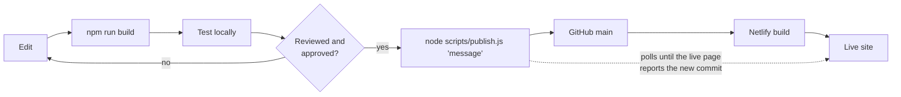

# Deployment

How a change goes from a working copy to the live site, and how to confirm it arrived.

## The pipeline



Hosting is Netlify, linked to this repository. **Every push to `main` deploys.** There is no staging
branch, so review happens before the push.

## The rule

> Nothing is committed or pushed until the change has been reviewed and approved.

Work is left in the working copy, described to the reviewer, and published only after they confirm.
See [contributing.md](contributing.md).

## Publishing

```bash
node scripts/publish.js "Describe the change in one line"
```

The script:

1. Rebuilds `index.html` from `asset-monitor.html`.
2. Stages everything and commits with your message (if there is anything to commit).
3. Pushes to `main`.
4. Polls the live page until its build stamp equals the commit it just pushed.
5. Prints `LIVE: <url> is serving <commit>` on success. If the site has not updated within the
   configured time it prints `NOT LIVE` and exits with code 2.

Report the outcome as printed. `NOT LIVE` usually means the Netlify build failed; open the project's
Deploys page in Netlify to see why.

To see what the live site is serving without publishing anything:

```bash
node scripts/publish.js --check
```

### Before you run it

```bash
git status --short          # is anything staged that should not be?
git diff --stat
```

The publish script stages everything that is not ignored. `.gitignore` is the safety net; you are the
first line of defence. See [security.md](security.md).

## What Netlify does on each deploy

Configured in `netlify.toml`:

| Setting | Value | Meaning |
|---|---|---|
| Build command | `node scripts/build-index.js` | Generates `index.html` and stamps in the commit id, the Mapbox token and the style from the environment |
| Publish directory | repository root | `index.html` is served at `/` |
| Node version | 22 | |
| Functions directory | `netlify/functions` | Each file becomes an endpoint |
| Bundler | esbuild, with the database packages kept external | |
| Schedule | `resnapshot` daily | The re-check that produces alerts |
| Headers | no-index, no-sniff, referrer policy | Applied to every response |

The build takes well under a minute.

## Configuration on the host

The live site reads its configuration from Netlify's environment variables. The names are:

| Name | Used at | Secret |
|---|---|---|
| `MAPBOX_TOKEN` | build, and by the add-asset function | no: a public token restricted to the site's address |
| `MAPBOX_STYLE` | build | no |
| `DB_INSTANCE`, `DB_NAME`, `DB_USER` | run time | no |
| `DB_PASSWORD` | run time | **yes** |
| `GCP_SA_KEY` | run time | **yes** |

Values are set by the administrator in Netlify and are not recorded anywhere in this repository.
After changing a variable, trigger a new deploy for it to take effect.

## Verifying a deploy

| Check | How |
|---|---|
| Right version is live | `node scripts/publish.js --check` |
| Database reachable from the site | Open `/.netlify/functions/db-health` on the live URL: `"ok": true` |
| Page is using live data | Dashboard subtitle reads "live from the AssetLogic database" |
| Map works | Open any property: basemap loads and the parcel outline is drawn |
| No errors | Browser developer console is clean |

## Rolling back

Netlify keeps every deploy.

- **Fastest:** in Netlify, open *Deploys*, pick the last good one, and choose *Publish deploy*. The
  site reverts immediately; the repository is unchanged.
- **Properly:** revert the commit and publish again, so the repository and the site agree:

```bash
git revert <commit>
node scripts/publish.js "Revert: <reason>"
```

A rollback of the page does not roll back the database. If a change altered data or structure, that
has to be reversed separately.

## Changing the site address

If the Netlify site is renamed or a custom domain is added:

1. Update `siteUrl` in `deploy.config.json`, or the publish script will poll the old address.
2. Ask the administrator to add the new address to the Mapbox token's allowed addresses, or the map
   will stop loading.

## Accounts and ownership

Which accounts own the repository, the hosting project, the database and the map service, and how
they connect, is recorded in the internal infrastructure map
([how to get it](README.md#internal-documents)).
