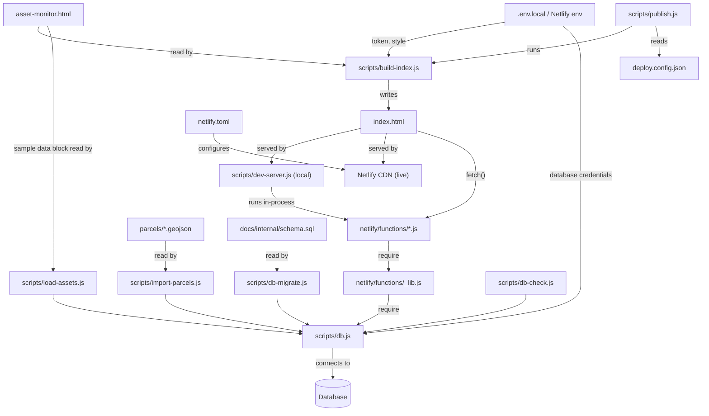

# Directory guide

Every file and folder in the repository: what it is, what reads it, what it produces, and whether you
should edit it.

## Map of the repository

```
AssetLogic_POC/
│
├── asset-monitor.html            ← THE PAGE (source of truth for the UI)
├── index.html                    ← generated from it; not in git
│
├── netlify/
│   └── functions/                ← THE API (server side)
│       ├── _lib.js                  shared helpers + the query that builds an asset
│       ├── assets.js                list / get / remove assets
│       ├── parcels.js               parcels in the current map view
│       ├── add-asset.js             address suggestions + create an asset
│       ├── monitoring.js            layers, alert rules, mark read, re-check one asset
│       ├── resnapshot.js            daily re-check of every asset → alerts
│       └── db-health.js             "can the site reach the database?"
│
├── scripts/                      ← TOOLING (runs on your machine or in the build)
│   ├── build-index.js               asset-monitor.html → index.html
│   ├── dev-server.js                local web server that also runs the functions
│   ├── publish.js                   build + commit + push + wait until live
│   ├── db.js                        database connection (used by scripts AND functions)
│   ├── db-check.js                  connectivity check
│   ├── db-migrate.js                create the schema + seed reference data
│   ├── import-parcels.js            stream a parcel file into the database
│   └── load-assets.js               load the sample assets into the database
│
├── docs/                         ← DOCUMENTATION
│   ├── *.md                         public docs (this set)
│   └── internal/                    internal docs; not in git
│
├── parcels/                      ← source parcel files; not in git
├── node_modules/                 ← installed dependencies; not in git
│
├── netlify.toml                  hosting configuration
├── package.json                  dependencies + npm scripts
├── package-lock.json             exact dependency versions
├── deploy.config.json            live URL + branch for the publish script
├── .env.example                  names of the configuration values
├── .env.local                    your values; not in git
├── .gitignore                    what git must never track
├── favicon.png                   the icon source image
├── landlogic-logo-colour.svg     the logo source image
├── CLAUDE.md                     rules for AI-assisted work on this repo
└── README.md                     start here
```

## How the files depend on each other



The single most important relationship: **`scripts/db.js` is the only place a database connection is
made**, and it is shared by the local scripts and by the deployed functions. There is one code path
to the database, not two.

## Root files

### `asset-monitor.html`
**The page.** About 1,650 lines containing, in order: the `<title>` and favicon, a `<style>` block
(design tokens, layout, components), the HTML markup (sidebar, map area with bottom sheet, dashboard
view, right-hand panel, menus and dialogs), and one `<script>` block with all browser logic.
It has no `<!DOCTYPE>`, `<html>` or `<head>` wrapper; the build adds those.
**Edit this file** for any UI change. Its internals are explained in [frontend.md](frontend.md).

### `index.html` (generated, git-ignored)
Produced by `scripts/build-index.js`. It is `asset-monitor.html` wrapped in a full HTML document,
with three values stamped into the `<head>`: the build id, the Mapbox token and the Mapbox style.
**Never edit it**; your change would be overwritten on the next build. It is not in git because it
contains the token.

### `netlify.toml`
Hosting configuration, read by Netlify on every deploy:
- `[build]`: run `node scripts/build-index.js`, publish the repository root.
- `[[headers]]`: tell search engines not to index the site; two basic hardening headers.
- `[functions]`: where the functions live, how to bundle them, which packages to keep external.
- `[functions."resnapshot"]`: run that function once a day.

### `package.json` / `package-lock.json`
One runtime dependency: `pg`, the PostgreSQL client. The `scripts` section defines the commands in the table below.
`package-lock.json` pins exact versions; commit it when dependencies change, never edit it by hand.

| Command | Runs | Purpose |
|---|---|---|
| `npm run build` | `scripts/build-index.js` | Regenerate `index.html` |
| `npm run dev` | `scripts/dev-server.js` | Local site + functions on port 8765 |
| `npm run db:check` | `scripts/db-check.js` | Confirm database access |
| `npm run db:migrate` | `scripts/db-migrate.js` | Create schema and seed reference data (administrators) |
| `npm run db:import-parcels -- <city>` | `scripts/import-parcels.js` | Import one city's parcels (administrators) |
| `npm run db:load-assets` | `scripts/load-assets.js` | Load the sample assets (administrators) |

### `deploy.config.json`
Four values used by `scripts/publish.js`: the live site URL, the git remote, the branch, and how many
minutes to wait for a deploy. Change `siteUrl` if the site's address changes.

### `.env.example` and `.env.local`
`.env.example` lists the **names** of the configuration values with no values; it is safe and
committed. `.env.local` is your copy with real values; it is git-ignored and must stay that way.
See [local-setup.md](local-setup.md) and [security.md](security.md).

### `.gitignore`
The list of things git must never track: the generated page, every `.env*` file, key files, the
internal docs, source data files, and tooling folders. Treat changes to it as security-relevant.

### `favicon.png`, `landlogic-logo-colour.svg`
Source images. The page embeds both inline (the favicon as a data URI, the logo as inline SVG), so
these files are references, not runtime dependencies.

### `CLAUDE.md`
Standing instructions for AI-assisted sessions working in this repository: which file is the source
of truth, that nothing is pushed without review, how to publish, and how secrets are handled.

## `netlify/functions/` (the API)

Each file exports one `handler(event)` that returns `{ statusCode, headers, body }`. Netlify serves
each at `/.netlify/functions/<file name>`. Full reference: [api.md](api.md).

| File | Responsibility | Talks to |
|---|---|---|
| `_lib.js` | Not an endpoint (the leading underscore). Response helpers, input validators, the single-user lookup, and `loadAssets()` / `loadAlerts()`, which assemble the JSON the page renders | `scripts/db.js` |
| `assets.js` | `GET` all assets and alerts, `GET` one asset, `DELETE` (archive) an asset | `_lib.js` |
| `parcels.js` | `GET` the parcels inside a bounding box, refusing boxes that are too large | `_lib.js` |
| `add-asset.js` | `GET` address suggestions; `POST` create an asset: geocode, create, enable layers, snapshot | `_lib.js`, Mapbox Geocoding |
| `monitoring.js` | `POST` actions: toggle a layer, set or remove a rule, mark alerts read, re-check one asset | `_lib.js` |
| `resnapshot.js` | Scheduled daily and callable by hand: re-check every asset, turn differences into alerts | `_lib.js` |
| `db-health.js` | `GET` server version and whether the schema exists. Returns no data and no credentials | `scripts/db.js` |

## `scripts/` (tooling)

| File | When it runs | What it does |
|---|---|---|
| `build-index.js` | Every Netlify deploy; locally via `npm run build` | Reads `asset-monitor.html`, reads the token and style from the environment (or `.env.local`), writes `index.html` with those and the commit id stamped in |
| `dev-server.js` | Locally via `npm run dev` | Serves the static page on port 8765 and runs any function at `/.netlify/functions/<name>` in the same process, mimicking Netlify. Refuses to serve `.env*`, `parcels/`, `scripts/`, `netlify/`, `.git/` |
| `publish.js` | When a reviewed change is ready | Builds, commits, pushes, then polls the live page until it reports the pushed commit id. `--check` only reports what the live site is serving |
| `db.js` | Imported by everything that needs the database | Loads configuration, opens a small TLS connection pool from `DATABASE_URL`, exposes `query()` and `close()`. Never logs a credential |
| `db-check.js` | Locally, to diagnose access | Prints server version, extensions, schemas and the current user's privileges |
| `db-migrate.js` | Once per database (administrators) | Runs the schema definition if the schema is absent, then seeds municipalities, data sources, the layer list and the administrator user. Safe to re-run |
| `import-parcels.js` | Per city (administrators) | Streams a large GeoJSON file, inserts or updates parcels 400 at a time, logs the run. Safe to re-run |
| `load-assets.js` | After parcels are imported (administrators) | Reads the sample data block from the page and writes the assets, their facts, layers, rules, alerts, applications and market series; links each asset to its parcel. Safe to re-run |

## `docs/`

The public documentation set; [README.md](README.md) is its index. `docs/internal/` holds the
internal documents and is git-ignored.

## Folders that are not in git

| Folder | Contents | How you get it |
|---|---|---|
| `node_modules/` | Installed dependencies | `npm install` |
| `parcels/` | Source parcel files (hundreds of megabytes) | From the project administrator, only if you need to re-import |
| `docs/internal/` | ERD, infrastructure map, schema, provisioning guide | From the project administrator |
| `.netlify/`, `.claude/` | Local tool state | Created by tools; safe to delete |

## "I want to change X, which file?"

| Change | File |
|---|---|
| Anything visible on the page | `asset-monitor.html` |
| What data an asset carries when it reaches the page | `netlify/functions/_lib.js` (`loadAssets`) |
| A new server action | A new file in `netlify/functions/`, or a new `action` in `monitoring.js` |
| How an address is matched to a parcel, or how facts are derived | The database functions (internal schema); see [database.md](database.md) |
| A new dataset | A new importer in `scripts/`, modelled on `import-parcels.js`; see [data-pipeline.md](data-pipeline.md) |
| Hosting, headers, schedules | `netlify.toml` |
| The live URL the publish script checks | `deploy.config.json` |
