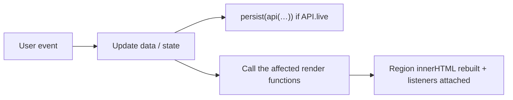

# Frontend guide

How `asset-monitor.html` is organised, how its code works, and how to change it safely.

## One file, three parts

| Lines (approx.) | Part | Contents |
|---|---|---|
| 1–6 | Head fragments | Title, favicon (embedded), font, Mapbox GL JS script and stylesheet |
| 7–475 | `<style>` | Design tokens, layout, components, responsive rules |
| 477–700 | Markup | The application shell and every dialog |
| 701–1657 | `<script>` | All browser logic |

There is no framework, no bundler and no module system. The script is plain JavaScript that runs top
to bottom once, then responds to events.

## Layout

```
┌──────────┬───────────────────────────────┬──────────────┐
│          │  Map area                     │ Right panel  │
│ Sidebar  │  ┌─────────────────────────┐  │  tabs:       │
│          │  │ map (Mapbox or drawn)   │  │  · My Assets │
│ nav      │  │                         │  │  · Layers    │
│ links    │  ├─────────────────────────┤  │  · Alerts    │
│          │  │ bottom sheet (detail)   │  │              │
│          │  └─────────────────────────┘  │              │
└──────────┴───────────────────────────────┴──────────────┘
           └── or, in dashboard mode: one full-width table view ──┘
```

The root element is `<div class="app" id="app">`, a three-column CSS grid. Three classes on it switch
the whole layout:

| Class | Effect |
|---|---|
| `mode-dash` | Hides the map area and right panel; shows the dashboard view |
| `has-map` | Mapbox is active: hides the drawn map canvas and its fake controls |
| `panel-collapsed` | Shrinks the right panel to a narrow rail |

## Styles

All colours, shadows and sizes are CSS custom properties defined once on `:root` (for example
`--ink`, `--accent-deep`, `--border`, `--surface`). A dark palette redefines the same names. Components
only ever use the variables, so a colour is changed in one place.

**House rule: text must never overflow its container.** Values wrap; grids use
`minmax(0, 1fr)` and `repeat(auto-fit, minmax(min(100%, Npx), 1fr))` so columns shrink instead of
spilling; chips may wrap. Do not add `white-space: nowrap` to anything that holds data.

## The script, section by section

The script is divided by banner comments. In order:

### Data
The layer catalogue (`LAYER_GROUPS`), municipality context (`MUNI`), and a **built-in sample data set**
(`ASSETS`, `ALERTS`, `SUGGESTIONS`). The sample set is what the page shows when the API is
unreachable. When the API responds, the contents of `ASSETS` and `ALERTS` are replaced in place.

### API client
```js
const API = { base: '/.netlify/functions', live: false, error: null };
async function api(name, opts)   // fetch wrapper: JSON in, JSON out, throws on error
async function loadLive()        // GET assets → replaces ASSETS and ALERTS, sets API.live
const persist = p => …           // fire-and-report for writes
```
`API.live` is the switch the rest of the code checks before sending a write.

### State
One object, `state`, holds everything that is not data: which view is showing, which asset is
selected, the sheet position, the active tab, filters, sort order, search text, the dashboard's
column and tile settings. Nothing else is global state.

Helpers defined here are used everywhere: `$` and `$$` (query selectors), `asset(id)`, `esc()` (HTML
escaping; **every value interpolated into markup goes through it**), `fullAddr()`, `ICONS`.

### Map
Two implementations behind one entry point:

```js
function renderMainMap() {
  if (MB.enabled) return renderMapbox();   // real map
  …drawMap(canvas, …)                      // drawn placeholder
}
```

- `MB` reads the token and style from `<meta>` tags that the build stamps in. `MB.enabled` is true
  only when a token exists and the Mapbox library loaded.
- `renderMapbox()` creates the map once, then on each call refreshes markers, the subject parcel and
  the camera. It keeps the selected property visible above the bottom sheet by offsetting the centre.
- `addSubjectLayer()` adds the map sources and layers: neighbouring `parcels`, and the `subject`
  (the asset's parcel polygon, or a point when no parcel is known).
- `loadParcelsInView()` runs when the map stops moving; at street-level zoom it asks the API for the
  parcels in view.
- `drawMap()` is a deterministic canvas drawing used for the fallback and for thumbnails when there is
  no token.

### Watchlist
`renderCards()` builds the cards in the right panel from `filteredAssets()`; the card menu handles
open, layers, report, save and remove.

### Selection and bottom sheet
`selectAsset(id)` sets the selection and refreshes map, cards and layers. `openSheet(id, tab)`
switches to map view if needed and slides the sheet up. `renderSheet()` fills the header, the KPI
strip and the tab bar; `renderTab(asset)` returns the HTML for the active tab. The Market tab's chart
is built by `chartSVG()` and made interactive by `wireChart()`.

### Layers panel and alert rules
`renderLayers()` lists the layer groups with a switch and a bell per layer. `toggleLayer()` flips a
layer; `openRule()` opens the rule dialog; saving writes to the asset and to the API.

### Alerts panel
`renderAlerts()`, `renderRules()` and `updateBadges()`.

### Add asset
Typing in the dialog asks the API for address suggestions (debounced). Confirming posts to the API,
which returns the finished asset; the page inserts it and opens it. Without the API, a local
simulation runs against the sample data.

### Dashboard view
`COLS` is the column definition: each entry has an id, a label, a sort function and a cell renderer.
`dashRows()` applies tile filter, class, municipality and search, then sorts. `renderDash()` draws the
summary tiles, the table, the latest flags and the rule list. `setMode('dash' | 'map')` switches views.

### Boot
```js
(async () => {
  await loadLive();
  renderAll();
  selectAsset(ASSETS[0] ? ASSETS[0].id : null);
  setMode('dash');
  if (!API.live) toast('Showing sample data: …');
})();
```

## How rendering works

There is no virtual DOM. Each `render…()` function rebuilds the `innerHTML` of one region from the
current data and state, then attaches that region's event listeners. After any change, the code calls
the render functions for the regions that depend on it. `renderAll()` redraws everything.



This is simple and fast at this scale. It does mean: **any value placed into markup must be passed
through `esc()`**, because data from the database is inserted as HTML.

## The shape of an asset

Every render function reads the same object shape, whether it came from the sample block or the API:

```js
{
  id, name, address, city, province, postal, cls, sub, added, checked,
  lnglat: [lng, lat],
  parcel: { id, address, area_m2, geojson } | null,
  zoning:   { code, bylaw, uses, status, statusLabel, … },
  op:       { designation, plan, secondary, chapter, status, statusLabel },
  heritage: { status, hcd, nearest, level },
  flood:    { status, authority, level, detail },
  env:      { status, level },
  appsTotal, apps: [ { addr, type, status, sev, date, desc, dist, lnglat } ],
  permits: [ … ], pipeline: { active, appealed, approved }, hazards: [ [label, sev, text] ],
  market:   { unit, metric, local: [24 numbers], city: [24 numbers], avgPrice, yoy, cap, rent, comps },
  layers: [ layerId ], rules: { layerId: { trigger, radius, channels, freq } },
  map: { pins: [ { t, lnglat, l, s, hot } ] }
}
```

`netlify/functions/_lib.js` produces exactly this. If you add a field the page needs, add it there
and in the sample block.

## Common changes

| To… | Do this |
|---|---|
| Add a dashboard column | Add an entry to `COLS` with `id`, `label`, `sort`, `cell` |
| Add a tab to the detail sheet | Add to `TABS`, add a `case` in `renderTab()` |
| Add a monitorable layer | Add to `LAYER_GROUPS`; the layer id must also exist in the database's layer list and in the functions' allowed list |
| Change a colour | Edit the custom property on `:root` (and its dark counterpart) |
| Add a summary tile | Add to the `tiles` array in `renderDash()` and a matching entry in `TILE_FILTER` |
| Show a new fact | Add it to the asset shape in `_lib.js`, then render it where needed |

After any edit:

```bash
npm run build
```

then reload http://localhost:8765.

## Things to keep in mind

- **Escape everything.** `esc()` on every interpolated value.
- **Both map modes must keep working.** If you add a map feature for Mapbox, make sure the drawn
  fallback still renders without errors.
- **Both data modes must keep working.** Guard writes with `if (API.live)`.
- **Hidden map.** In dashboard view the map container has no size. Code that positions the map must
  tolerate that; `renderMapbox()` already skips positioning while hidden.
- **No overflow.** Test at a narrow window width before calling a change done.
